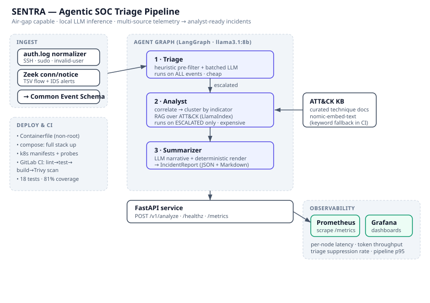

# SENTRA

**Agentic SOC triage pipeline.** SENTRA ingests heterogeneous security telemetry, triages it through a graph of LLM agents, correlates related activity into incidents, maps each incident to MITRE ATT&CK techniques via retrieval-augmented generation, and emits an analyst-ready report — running entirely on **local inference**, so it can operate in air-gapped and secure environments where telemetry cannot leave the host.



## Why local-only

A SOC handling sensitive or classified telemetry cannot ship logs to a cloud LLM API. SENTRA runs against a local [Ollama](https://ollama.com) instance (`llama3.1:8b` for the agents, `nomic-embed-text` for retrieval), so the entire reasoning pipeline stays on-host. The trade-off — inference is the bottleneck — is met head-on by the architecture and made measurable by the observability layer.

## What it does

1. **Ingest** — normalizes Linux `auth.log` and Zeek `conn.log`/`notice.log` into one Common Event Schema. New sources need one normalizer, not changes to the agents.
2. **Triage** — a cheap heuristic pass decides the obvious cases for free; only ambiguous events reach the LLM, batched into a single call. Cuts inference cost where it matters most.
3. **Analyst** — clusters escalated events that share an indicator (e.g. an attacker IP) into a single incident, retrieves relevant ATT&CK techniques from a curated knowledge base, and maps them with grounded rationale. Hallucinated technique IDs are rejected.
4. **Summarize** — the LLM writes the analytical narrative; all structural content (IDs, counts, technique tables) is rendered deterministically. The model reasons, it does not format.

Output ships as both structured JSON (for ticketing/SIEM integration) and rendered Markdown (for humans).

## Quickstart

### Full stack (one command)

```bash
podman compose up        # or: docker compose up
```

This starts Ollama, pulls the models on first run, launches the API, and brings up Prometheus + Grafana with the dashboard auto-provisioned.

- API:        http://localhost:8000  (`/healthz`, `/metrics`, `POST /v1/analyze`)
- Prometheus: http://localhost:9090
- Grafana:    http://localhost:3000  (anonymous viewer enabled)

```bash
curl -s http://localhost:8000/v1/analyze \
  -H 'content-type: application/json' \
  -d "{\"content\": $(jq -Rs . < data/samples/auth.log), \"source\": \"auth_log\"}" | jq .report.markdown -r
```

### CLI (no API, local Ollama)

```bash
ollama serve & ollama pull llama3.1:8b && ollama pull nomic-embed-text
pip install ".[agents]"
sentra analyze data/samples/auth.log data/samples/conn.log data/samples/notice.log
```

### Tests (no GPU, no Ollama)

```bash
pip install ".[dev]"
pytest                   # 18 tests, offline via an injected fake LLM client
```

## Design decisions

**Why a graph, not one big prompt.** A single "here are all the events, what happened?" call does not scale, is unauditable, and conflates cheap filtering with expensive reasoning. A graph gives each node one job, an explicit state trail, and a cost boundary between tiers.

**Swappable dependencies.** The retriever, LLM client, and orchestrator each have a production implementation and a dependency-free fallback (embedding RAG ↔ keyword RAG; Ollama ↔ fake client; LangGraph ↔ sequential runner). Same interfaces, so CI runs the real pipeline logic without a GPU and can never drift from production behavior.

**Trust boundaries.** The model is trusted to reason (triage judgement, technique rationale, narrative) and never to produce facts that must be exact (IDs, counts, tables) — those are computed in code. Hallucinated ATT&CK IDs are filtered against the knowledge base.

## Observability

Every LLM call records latency and token counts, labelled by graph node, plus pipeline-level counters (ingested, escalated, suppressed, incidents by severity). The Grafana dashboard surfaces per-node latency, token throughput by agent, end-to-end pipeline p95, and the **triage suppression rate** — the metric that proves the cost-control design is working.

## Layout

```
src/sentra/
  common/        Common Event Schema (Pydantic)
  ingest/        normalizers + source-sniffing dispatcher
  rag/           ATT&CK retriever (embedding + keyword fallback)
  orchestrator/  graph state, Ollama client, LangGraph + sequential runners
  agents/        triage · analyst · summarizer
  api/           FastAPI service
  observability/ Prometheus metrics
data/
  samples/       correlated SSH-compromise demo telemetry
  attack_kb/     curated ATT&CK technique knowledge base
k8s/             deployment, service, configmap
observability/   prometheus.yml, grafana provisioning + dashboard
```

## Roadmap

- Additional source normalizers (Windows EVTX, Sysmon, cloud audit logs)
- Conditional graph routing (skip RAG for low-confidence singletons)
- LangGraph checkpointing for long-running batch analysis
- Streaming intermediate state to the API for live triage UIs

## License

Apache-2.0. ATT&CK technique summaries in `data/attack_kb/` are original paraphrases; MITRE ATT&CK® is a registered trademark of The MITRE Corporation.
